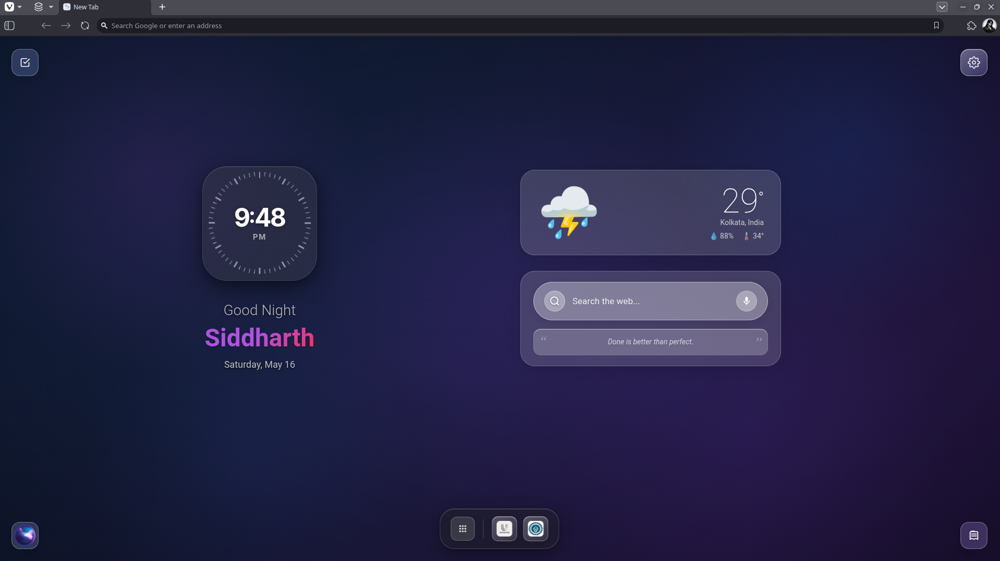

# GNT: iOS Refined

Forked from "GNT: Glass New Tab – iOS Style Dashboard” by Animesh Patra. A privacy-first Chrome extension that transforms your new tab with a beautiful glass morphism dashboard inspired by iOS and macOS design.



## ✨ Features

- **Glass Morphism Design** — Modern, elegant UI inspired by iOS 17+ and macOS aesthetics
- **Privacy-First Architecture** — All data stored locally; no backend servers or analytics tracking
- **Customizable Dashboard** — Weather, shortcuts, search, and more at a glance
- **Dark & Light Themes** — Automatic or manual theme switching
- **Optional Weather Integration** — Real-time weather with optional GPS-based location detection
- **Chrome Search API** — Spotlight-style search across bookmarks and history
- **Shortcut Management** — Quick access to frequently visited sites
- **Responsive Design** — Optimized for desktop, laptop, and large screens
- **Smart Caching** — Rounded location caching for privacy-preserving weather

## 🆕 Enhancements in GNT iOS Refined

- **Refined To-Do Experience** — Improved text grammar, updated icon consistency, and enhanced visual alignment
- **Smooth UI Animations** — Added pop-in animations and improved menu positioning for To-Do List, aligned with Sticky Notes design language
- **Polished Iconography** — Fixed Sticky Notes icon centering and redesigned AI Tools icon with an iOS-style (Siri-inspired) look
- **Adaptive Layout Behavior** — Automatically centers Weather and Search when Clock is hidden and Greetings are disabled
- **Improved Weather UI Alignment** — Corrected layout for “Feels Like” and humidity metrics
- **Custom AI Tools Management** — Add or remove AI tools dynamically based on your preferences
- **Expanded Dock Customization** — Add custom apps to All Apps (no longer limited to preset Google apps)
- **Full Control Over Custom Apps** — Easily remove all custom dock apps in one action
- **App Reordering Support** — Reorder apps freely in both Custom Dock and All Apps sections
- **Custom Icon Support** — Assign custom icons via links for Dock Apps, All Apps, and AI Tools

## 🚀 Installation

1. **Clone or download this repository**

   ```bash
   git clone https://github.com/acetheunfazed/GNT-iOS-Refined.git
   ```

2. **Open Chrome Extensions**
   - Navigate to `chrome://extensions/`
   - Enable **Developer mode** (top-right toggle)

3. **Load unpacked extension**
   - Click **Load unpacked**
   - Select the repository folder
   - Extension is now active!

## 🔒 Privacy & Security

This extension is **privacy-first** by design:

✅ **What We Store Locally:**

- Your preferences and settings (theme, units, etc.)
- Shortcuts and custom links
- Search shortcuts and commands

❌ **What We Don't Collect:**

- No personal browsing history tracking
- No analytics or usage data
- No advertising or profiling
- No backend servers — everything runs locally

**Optional Permissions:**

- **Geolocation** — Only used for optional weather feature when you explicitly enable GPS-based weather. Location is not shared with developers.
- **Storage API** — Stores your preferences locally on your device
- **Weather Services** — Third-party services (Open-Meteo, WeatherAPI) only receive anonymized coordinates when you enable weather

See [Privacy Page](https://acetheunfazed.github.io/GNT-iOS-Refined/privacy.html) for detailed privacy policy.

## ⚙️ Configuration

### Settings Available

- **Theme** — Dark, Light, or Auto (system preference)
- **Temperature Unit** — Celsius or Fahrenheit
- **Weather Location** — Manual entry or GPS-based
- **Search Shortcuts** — Customize search engine shortcuts
- **Appearance** — Glass intensity, accent colors, wallpaper

### Storage

All settings saved in `chrome.storage.local`:

- Preferences
- Shortcuts
- Theme configuration
- Optional weather location cache

## 🛠️ Development

### Project Structure

```
├── manifest.json                # Chrome extension manifest

├── newtab.html                  # Main new tab UI
├── newtab.js                    # New tab logic
├── newtab.css                   # New tab styling

├── popup.html                   # Extension popup UI
├── popup.js                     # Popup logic

├── privacy.html                 # Privacy policy page
├── privacy.css                  # Privacy page styling

├── settings.html                # Main settings entry (legacy/global)
├── settings.css                 # Global settings styles
├── settings.js                  # Global settings logic
├── settingsStore.js             # Centralized storage management

├── settings/                    # Modular settings system
│   ├── settings.html            # New settings layout
│   ├── settings.css             # Settings styling
│   ├── settings.js              # Settings controller
│   │
│   ├── appearance.html          # Appearance settings UI
│   ├── appearance.js
│   │
│   ├── search.html              # Search settings UI
│   ├── search.js
│   │
│   ├── shortcuts.html           # Shortcuts management UI
│   ├── shortcuts.js
│   │
│   ├── liquid-glass.css         # Glass UI styling system
│   └── liquid-glass.js          # Glass effects logic

├── assets/
│   └── icons/                   # Extension icons
│       ├── ai.gif
│       ├── favicon.ico
│       ├── icon-16.png
│       ├── icon-32.png
│       ├── icon-48.png
│       └── icon-128.png

├── early-theme.js               # Theme initialization (pre-load)
└── README.md                    # Project documentation
```

### Technologies Used

- **HTML5** — Semantic markup
- **CSS3** — Glass morphism, CSS Grid, Flexbox, CSS Variables
- **JavaScript (ES6+)** — Chrome Storage API, Chrome Search API
- **Chrome APIs** — storage, search, tabs, scripting

### Local Development

1. Make changes to source files
2. In `chrome://extensions/`, click the refresh icon
3. Test the extension with a new tab

### Building for Release

```bash
# Create optimized zip archive
Compress-Archive -Path * -DestinationPath "GNT-iOS-Refined-v3.0.0.zip"
```

## 📦 Optional Dependencies

The extension uses optional third-party services for specific features:

| Service                    | Purpose           | Data Sent   | Optional |
| -------------------------- | ----------------- | ----------- | -------- |
| **Open-Meteo**             | Weather data      | Coordinates | ✅ Yes   |
| **WeatherAPI**             | Weather data      | Coordinates | ✅ Yes   |
| **BigDataCloud**           | Geolocation       | IP address  | ✅ Yes   |
| **Nominatim**              | Reverse geocoding | Coordinates | ✅ Yes   |
| **DuckDuckGo**             | Favicon fetching  | Domain name | ✅ Yes   |
| **Google Favicon Service** | Favicon fetching  | Domain name | ✅ Yes   |

All services are contacted directly from your browser—no data relay through developer servers.

## 🤝 Contributing

Contributions are welcome! Please:

1. Fork the repository
2. Create a feature branch (`git checkout -b feature/awesome-feature`)
3. Make your changes with clear commit messages
4. Push to the branch (`git push origin feature/awesome-feature`)
5. Open a Pull Request

## 📄 License

This project is licensed under the MIT License. See the LICENSE file for details.

## 👨‍💻 Authors

- **[Animesh Patra](https://github.com/developer-animesh7)** — Original Developer / Base Project Creator
- **[AceTheUnfazed](https://github.com/acetheunfazed)** — Refiner / Maintainer of _GNT: iOS Refined_

📧 Email: animeshpatra7908@gmail.com

## 📋 Changelog

### Version 3.0.0 (April 18, 2026)

- 🚀 Major release and version alignment across extension pages
- 🧾 Updated docs and build artifact naming for 3.0.0 packaging

### Version 2.5.0 (March 29, 2026)

- ✨ Enhanced glass morphism design
- 🔒 Privacy policy with semantic icons
- 🎨 Improved theme switching
- 📍 Optional GPS-based weather with rounded location caching
- 🛡️ Security hardening for permissions
- 📱 Better responsive design

### Version 2.4.x

- Previous features and improvements

## 🙏 Acknowledgments

- Glass morphism design inspiration from Apple's iOS 17+ and macOS aesthetic
- Weather data from Open-Meteo and WeatherAPI
- Community feedback and contributions

## ⚠️ Disclaimer

This extension is not affiliated with Google Chrome or Google Inc. Chrome is a trademark of Google LLC.

---

**Ready to transform your new tab experience?** Install now and enjoy a beautiful, private dashboard!
